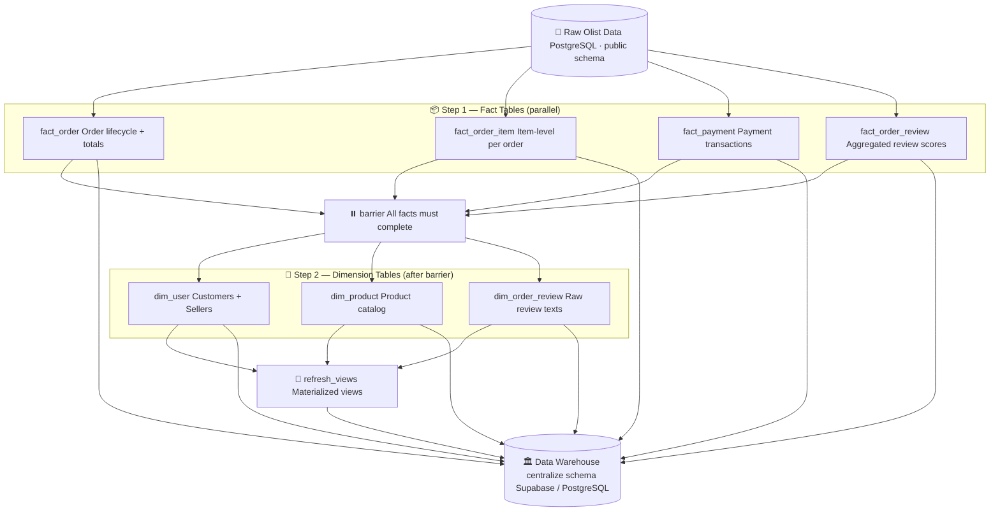
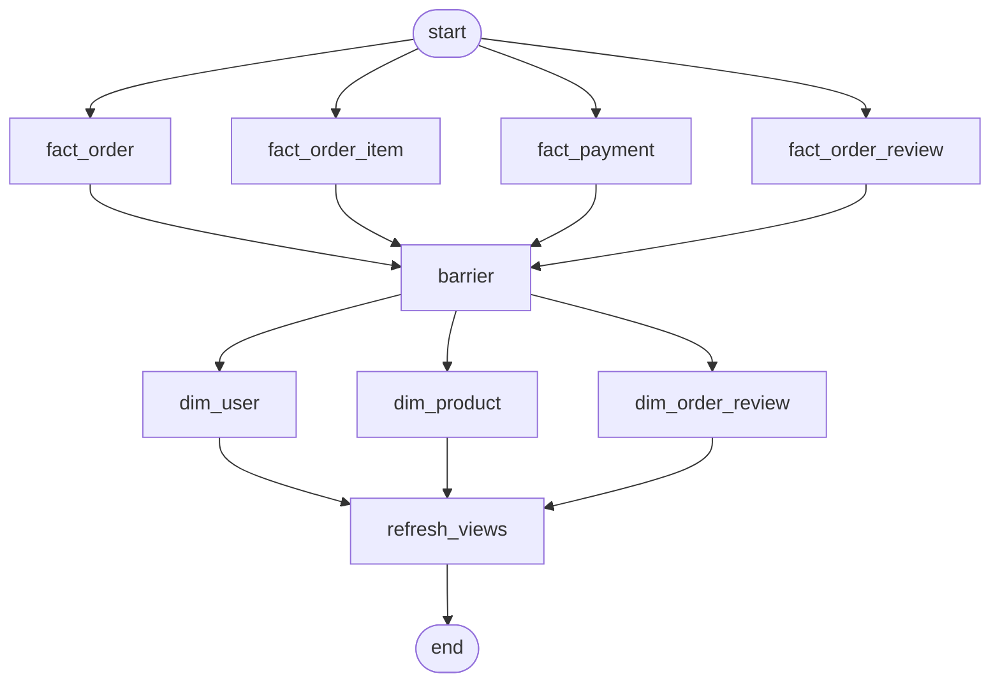
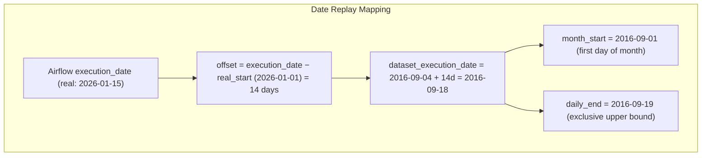
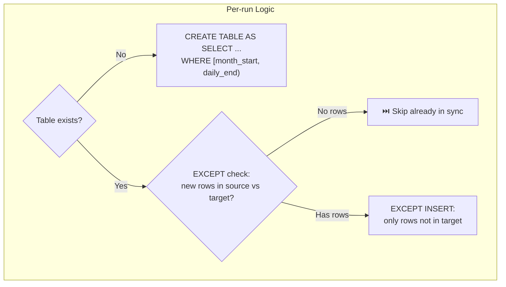
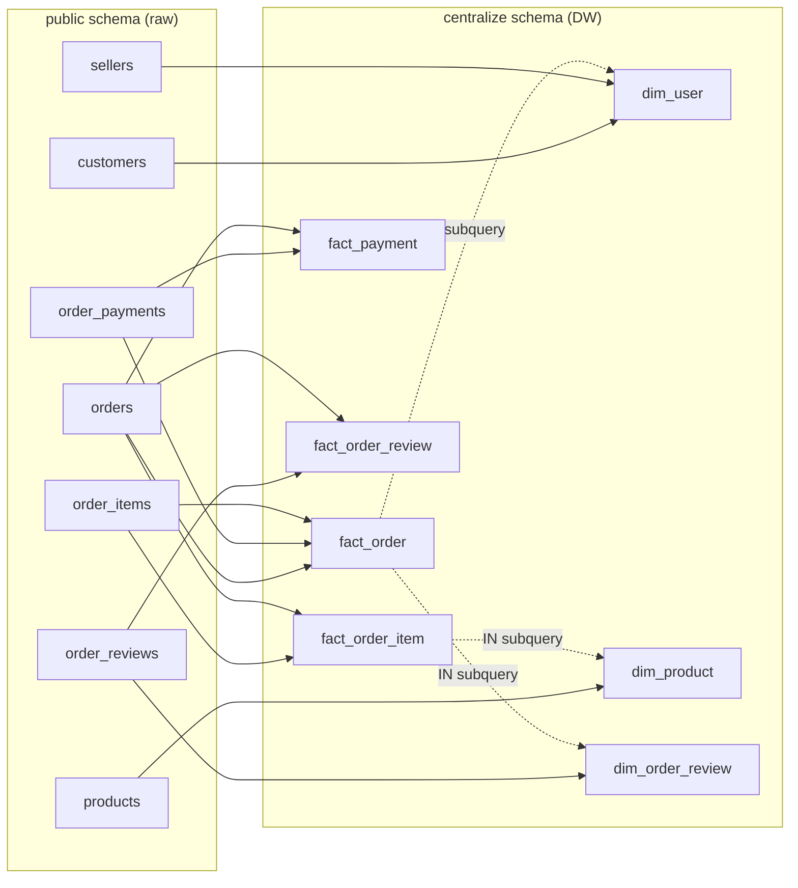

# Centralize Pipeline — Architecture



---

## Giải thích từng bước

**Step 1 — Fact Tables (chạy song song)**
> 4 fact tables chạy cùng lúc, mỗi table load dữ liệu từ raw source theo window `[month_start, daily_end)`. Dữ liệu được filter theo `order_date` để đảm bảo chỉ insert đúng cửa sổ cần thiết.

**Barrier — tất cả facts phải xong**
> `EmptyOperator` làm điểm chờ để đảm bảo tất cả 4 fact tables đã hoàn thành trước khi dim tables bắt đầu. Dims cần join ngược lại các fact tables để lấy danh sách unique IDs.

**Step 2 — Dimension Tables (sau barrier)**
> Dim tables chạy song song sau khi barrier thông qua. Không có date column trong output — dùng EXCEPT INSERT so với toàn bộ target table để tránh duplicate.

**refresh_views — sau khi tất cả dims xong**
> Refresh tất cả materialized views được khai báo trong `report_views.yaml`. Chạy sau cùng để views luôn phản ánh dữ liệu mới nhất.

**Output — centralize schema**
> Toàn bộ dữ liệu được chuẩn hóa vào schema `centralize` trên Supabase, sẵn sàng cho BI dashboards và MCP tools.

---

## Hai DAG — Hai Orchestration Pattern

Hiện tại có 2 DAGs cho centralize pipeline, dùng logic orchestration khác nhau:

| DAG | dag_id | Orchestrator | Pattern |
|---|---|---|---|
| `star_centralize_pipeline.py` | `centralize_pipeline_operator` | `run_star_schema()` | Daily EXCEPT-based, có `barrier` + `refresh_views` |
| `centralize_pipeline.py` | `centralize_pipeline_backfill` | `run_backfill()` | Monthly loop, max_date check, dims phụ thuộc `fact_order` |

> `centralize_pipeline_operator` là pipeline chính (có `barrier`, `refresh_views`, và retroactive data support).

---

## Data Coverage & Department Access

| Table | Columns Key | Department |
|---|---|---|
| `fact_order` | order_id, customer_id, order_date, status, total_payment, total_items | Commercial |
| `fact_order_item` | order_id, product_id, seller_id, order_date, total_price, freight | Commercial |
| `fact_payment` | order_id, payment_type, installments, order_date, total_payment_value | Finance |
| `fact_order_review` | order_id, order_date, avg_score, total_reviews, last_review_date | Customer |
| `dim_user` | user_id, user_type (customer/seller), city, state | Customer |
| `dim_product` | product_id, category_name, weight, dimensions | Commercial |
| `dim_order_review` | review_id, order_id, title, message, creation_date | Customer |

> Data range: **2016-09-04 → 2018-10-17** (Brazilian e-commerce dataset)

---

## Technical Deep-Dive (for Q&A)

### Pipeline Orchestration — `centralize_pipeline_operator`



> - Facts chạy song song từ `start` — không phụ thuộc nhau.
> - `barrier` EmptyOperator chờ tất cả 4 facts hoàn thành.
> - Dims chạy song song sau `barrier`.
> - `refresh_views` chạy cuối cùng, sau tất cả dims.
> - `depends_on_past=True` trên mỗi task → đảm bảo thứ tự thời gian, không chạy ngày T+1 khi ngày T chưa xong.

---

### Date Replay Mapping — `run_star_schema`



> SQL window per run: `[month_start, daily_end)` — cửa sổ bắt đầu từ đầu tháng đến `dataset_execution_date + 1 day`. Pattern này hỗ trợ **retroactive data**: nếu một order từ đầu tháng được thêm muộn vào source, EXCEPT check sẽ phát hiện và insert vào lần chạy tiếp theo.

---

### EXCEPT-based Idempotency — `run_star_schema`



**Fact tables:** EXCEPT compares source `[month_start, daily_end)` vs target scoped to same window.

**Dim tables:** EXCEPT compares source `[month_start, daily_end)` vs entire target (no date column in dims).

> Không có monthly loop — mỗi Airflow run xử lý đúng một cửa sổ ngày.

---

### SQL Strategy per Table Type

| Table Type | First Run | Re-run / Incremental | Idempotency |
|---|---|---|---|
| **Fact** | `CREATE TABLE AS SELECT ...` | EXCEPT check → EXCEPT INSERT scoped to `[month_start, daily_end)` | Row-level EXCEPT — bỏ qua rows đã có |
| **Dim** | `CREATE TABLE AS SELECT DISTINCT ...` | EXCEPT check → EXCEPT INSERT vs entire target | Row-level EXCEPT — không duplicate |

> Fact tables dùng `order_date` range filter (`month_start` → `daily_end`) per run.
> Dim tables không có date column trong output — EXCEPT so với toàn bộ target.

---

### Source → Target Lineage



---

### Config Structure (per table YAML)

```yaml
postgres:
  conn_id: supermarket          # Airflow connection ID → Supabase
  target:
    schema: centralize          # target schema
    table: fact_order           # target table
    date_column: order_date     # column used for EXCEPT fact window scope

query:
  function:
    create: create table if not exists {{ schema }}.{{ table }} as
    insert: insert into {{ schema }}.{{ table }}
  sql: |
    SELECT ... FROM public.orders
    WHERE order_date >= '{{start_date}}' AND order_date < '{{end_date}}'
```

---

### Module Dependency Tree

```
dags/star_centralize_pipeline.py                      ← Main pipeline (operator)
  └── services/orchestrations/operator.py              run_star_schema()
        ├── services/core/config.py                    load_config()
        ├── services/core/validate.py                  validate_config / identifier / date / pg / sql
        └── services/core/sql.py                       check_exist_table · check_data_available
                                                       render_template · execute_sql
  └── services/orchestrations/materialized_view.py     refresh_materialized_views()
        ├── services/core/config.py                    load_config()
        ├── services/core/validate.py                  validate_identifier / pg
        └── services/core/sql.py                       execute_sql

dags/centralize_pipeline.py                           ← Legacy pipeline (backfill)
  └── services/orchestrations/backfill.py              run_backfill()
        ├── services/core/config.py                    load_config()
        ├── services/core/validate.py                  validate_config / identifier / date / pg / sql
        ├── services/core/sql.py                       check_exist_table · check_data_available
        │                                              render_template · execute_sql · get_max_date
        └── services/core/backfill_services.py
              ├── resolve_raw_sql()                    CREATE vs INSERT vs EXCEPT INSERT
              ├── resolve_start_date_dt()              from max_date or config default
              └── build_sql_for_month()                render template for [start, start+1month)
```
