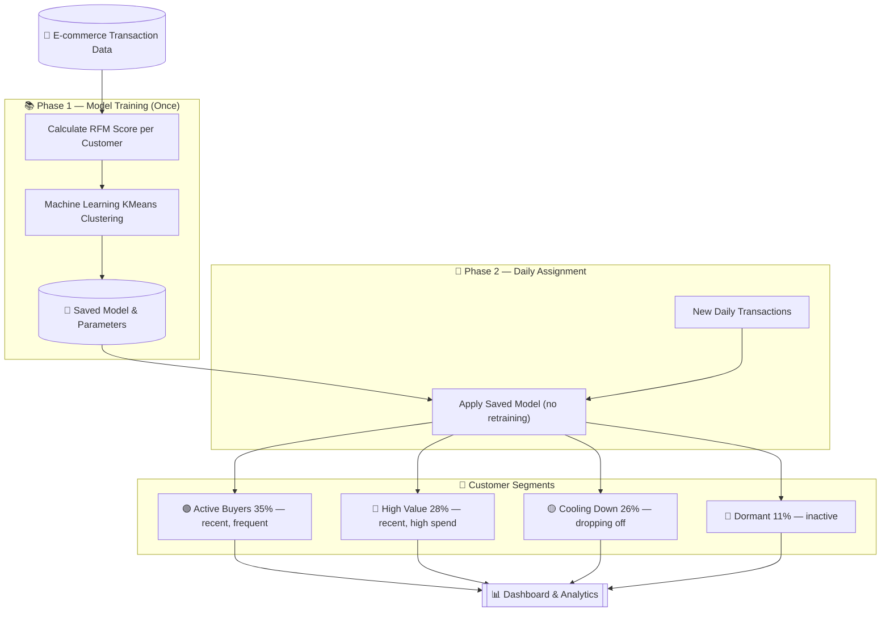
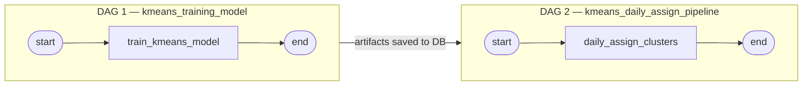
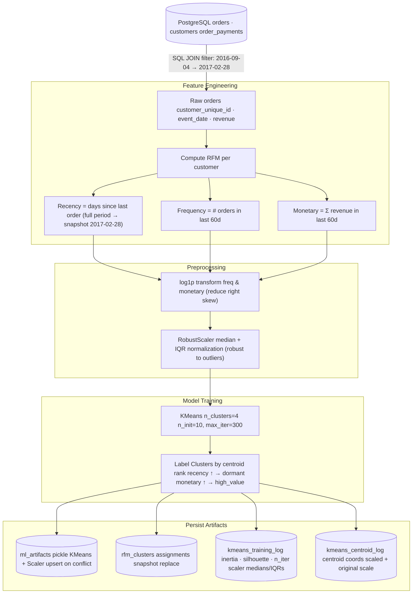
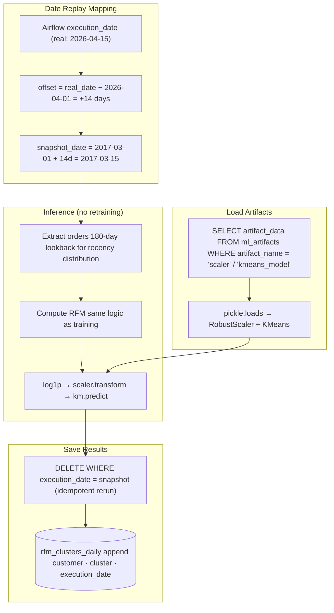

# KMeans RFM Customer Segmentation — High-Level Architecture



---

## Giải thích từng phase

**Phase 1 — Training (chạy một lần)**
> Hệ thống học từ lịch sử giao dịch: mỗi khách hàng được chấm điểm theo 3 tiêu chí — mua gần đây chưa, mua bao nhiêu lần, chi bao nhiêu tiền. Sau đó thuật toán KMeans tự động chia khách hàng thành 4 nhóm và lưu lại mô hình.

**Phase 2 — Daily (chạy mỗi ngày)**
> Mỗi ngày, hệ thống dùng mô hình đã học để phân loại khách hàng mới vào đúng nhóm — không cần train lại.

**4 Segments (output thực tế)**

| Segment | % Users | Đặc điểm | Chiến lược |
|---|---|---|---|
| 🟢 Active Buyers | 35% | Mua gần đây, thường xuyên | Retention · Cross-sell · Loyalty |
| 💎 High Value | 28% | Mua gần đây, chi tiêu cao | VIP perks · Upsell · Exclusive offers |
| 🟡 Cooling Down | 26% | Đang giảm tần suất | Win-back · Limited-time offer |
| 🔴 Dormant | 11% | Không hoạt động | Last-chance discount · Suppress |

---

## Technical Deep-Dive (for Q&A)

### Pipeline Orchestration (Apache Airflow)



> - DAG 1 chạy một lần trên dữ liệu training (2016-09-04 → 2017-02-28), `depends_on_past=True` đảm bảo tuần tự.
> - DAG 2 chạy mỗi ngày từ 2026-04-01, `catchup=True` để backfill toàn bộ lịch sử. Hai DAG liên kết qua DB, không coupling trực tiếp.

---

### Training Pipeline — Step by Step



---

### Daily Inference Pipeline — Step by Step



---

### RFM Feature Definition

| Feature | Window | Formula | Why |
|---|---|---|---|
| **Recency** | Full period | `snapshot_date − max(order_date)` in days | Đo mức độ active gần nhất |
| **Frequency** | Last **60 days** | Count of orders in window | Đo tần suất mua trong thời gian gần |
| **Monetary** | Last **60 days** | `Σ payment_value` in window | Đo giá trị chi tiêu gần đây |

> Customers mua ngoài 60-day window → Frequency = 0, Monetary = 0 → tự động rơi vào **Cooling Down** hoặc **Dormant**.

---

### Cluster Labeling Logic

```
centroids (original scale)
        │
        ├─ highest Recency  ──────────────────► dormant
        │
        └─ remaining 3
                │
                ├─ highest Monetary  ─────────► high_value
                │
                └─ remaining 2
                        │
                        ├─ lowest Recency  ───► active_buyers
                        └─ other  ────────────► cooling_down
```

> Logic này đảm bảo label assignment **deterministic** và không phụ thuộc vào cluster ID ngẫu nhiên của KMeans mỗi lần train.

---

### Database Schema (customer_segmentation)

```mermaid
erDiagram
    ml_artifacts {
        varchar artifact_name PK
        bytea   artifact_data
        timestamp updated_at
    }

    rfm_clusters {
        varchar customer_unique_id PK
        int     recency
        float   frequency
        float   monetary
        int     cluster_id
        varchar cluster_name
        timestamp updated_at
    }

    rfm_clusters_daily {
        varchar customer_unique_id
        int     recency
        float   frequency
        float   monetary
        int     cluster_id
        varchar cluster_name
        date    execution_date
        timestamp updated_at
    }

    kmeans_training_log {
        serial  id PK
        timestamp trained_at
        date    start_date
        date    end_date
        int     n_samples
        int     n_clusters
        float   inertia
        float   silhouette
        int     n_iter
        float   recency_median
        float   frequency_median
        float   monetary_median
        float   recency_iqr
        float   frequency_iqr
        float   monetary_iqr
    }

    kmeans_centroid_log {
        serial  id PK
        int     training_id FK
        int     cluster_id
        varchar cluster_name
        float   recency_scaled
        float   frequency_scaled
        float   monetary_scaled
        float   recency_orig
        float   frequency_orig
        float   monetary_orig
    }

    kmeans_training_log ||--o{ kmeans_centroid_log : "training_id"
```


